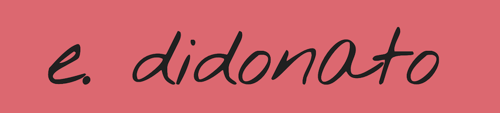

<h2 align="center">hello, i'm eddie</h2>
<h3 align="center">web developer</h3>

## about me. 🍍 

### a writer and hospitality professional turned web developer.  
____
After years of program development in cocktail bars, I decided to take on a new creative outlet.  An empathetic background has always made me sensible of the end-user, who is always on my mind when i'm developing.

##  what i do. ⚙️
* i love building in ⚛️ React
* i'm a stickler for responsive design
* i have a lot of fun 💅🏽 styling my projects
* always learning 🤓 

check out my [resume](https://drive.google.com/file/d/1NwVrZAhES0f3gqt6rjgzFkPIW3BJYfSe/view?usp=sharing), peruse my [portfolio](https://didonato.io), or <a href="mailto:edward.f.didonato@gmail.com">contact me directly</a>

<!--
**edidonato1/edidonato1** is a ✨ _special_ ✨ repository because its `README.md` (this file) appears on your GitHub profile.

Here are some ideas to get you started:

- 🔭 I’m currently working on ...
- 🌱 I’m currently learning ...
- 👯 I’m looking to collaborate on ...
- 🤔 I’m looking for help with ...
- 💬 Ask me about ...
- 📫 How to reach me: ...
- 😄 Pronouns: ...
- ⚡ Fun fact: ...
-->
